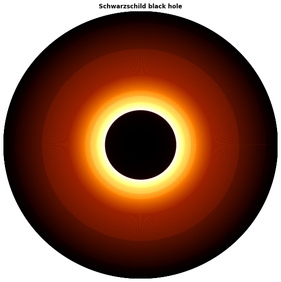

## Schwarzschild

Notebooks para la métrica de Schwarzschild.

- [Schwarzschild 2D](https://github.com/davidguzmanr/Servicio-Fisica/blob/master/Notebooks/Schwarzschild/Schwarzschild%202D.ipynb) contiene el caso especial del plano ecuatorial .
- [Schwarzschild 3D](https://github.com/davidguzmanr/Servicio-Fisica/blob/master/Notebooks/Schwarzschild/Schwarzschild%203D.ipynb) contiene el caso general con ayuda de [einsteinpy](https://github.com/einsteinpy/einsteinpy).
- [Sombra](https://github.com/davidguzmanr/Servicio-Fisica/blob/master/Notebooks/Schwarzschild/Sombra.ipynb) contiene la representación de la sombra de un agujero negro de Schwarzschild con ayuda de [einsteinpy](https://github.com/einsteinpy/einsteinpy).

</img>
